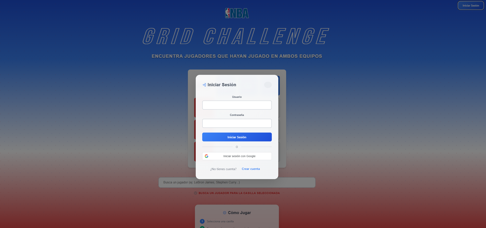
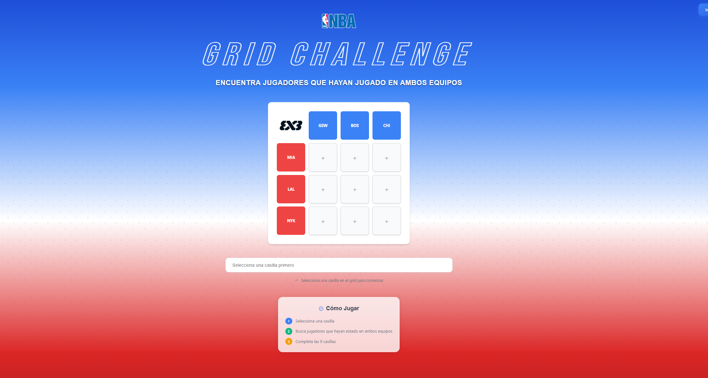

# NBA Grid Game




A web-based NBA puzzle game where players must fill a 3x3 grid with NBA players who have played for the intersecting teams.

## Overview

NBA Grid is an interactive puzzle game that challenges users to find NBA players who have played for specific team combinations. The game presents a 3x3 grid where each cell represents the intersection of two teams, and players must find athletes who have played for both teams during their career.

## Features

### Core Gameplay
- Interactive 3x3 grid with team intersections
- Real-time player search with autocomplete
- Validation system using multiple NBA APIs
- Visual feedback for correct/incorrect selections
- Player headshot images with fallback to initials

### Authentication System
- User registration and login
- Google OAuth integration
- SQLite database for user management
- Session management with JWT tokens

### Technical Features
- Scalable backend API with multiple data sources
- Client-side and server-side caching
- Rate limiting and API fallbacks
- Responsive design with modern UI
- Real-time notifications

## Project Structure

```
nba-grid-app/
├── public/
│   ├── c1.png                 # Game screenshot 1
│   ├── c2.png                 # Game screenshot 2
│   ├── logo3x3.png           # Game logo
│   └── logonba.png           # NBA logo
├── src/
│   ├── components/
│   │   ├── AuthHeader.tsx     # Authentication header component
│   │   ├── AuthModal.tsx      # Login/register modal
│   │   ├── NBAGrid.tsx        # Main game grid component
│   │   └── PlayerSearch.tsx   # Player search interface
│   ├── services/
│   │   └── apiService.ts      # Frontend API service with caching
│   ├── types.ts               # TypeScript type definitions
│   ├── App.tsx                # Main application component
│   └── App.css                # Application styles
├── nba-grid-api/
│   ├── index.js               # Main backend server
│   ├── auth-backend.js        # Authentication backend
│   ├── staticData.js          # Static fallback data
│   ├── nba_grid_users.db      # SQLite database
│   └── AUTH_SETUP.md          # Authentication setup guide
└── package.json               # Frontend dependencies
```

## Technology Stack

### Frontend
- **React 18** with TypeScript
- **Vite** for build tooling and development server
- **Modern CSS** with inline styles and responsive design
- **Fetch API** for HTTP requests

### Backend
- **Node.js** with Express.js
- **SQLite** for user data storage
- **JWT** for authentication tokens
- **Google OAuth 2.0** for social authentication
- **Multiple NBA APIs** for player and team data

### APIs and Data Sources
- **Ball Don't Lie API** - Primary NBA data source
- **NBA Stats API** - Official NBA statistics
- **NBA.com Headshots** - Player profile images
- **Static fallback data** - Ensures reliability

## Installation and Setup

### Prerequisites
- Node.js 16+ and npm
- Git

### Frontend Setup
```bash
# Clone the repository
git clone <repository-url>
cd nba-grid-app

# Install dependencies
npm install

# Start development server
npm run dev
```

### Backend Setup
```bash
# Navigate to backend directory
cd nba-grid-api

# Install backend dependencies
npm install

# Start the main API server
node index.js

# In a separate terminal, start the authentication server
node auth-backend.js
```

### Google OAuth Setup
1. Create a Google Cloud Project
2. Enable Google+ API
3. Create OAuth 2.0 credentials
4. Update the client ID in `AuthModal.tsx`

## API Architecture

### Backend Endpoints

#### Main API Server (Port 4000)
- `GET /teams` - Retrieve all NBA teams
- `GET /players/search` - Search for players by name
- `GET /validate-player` - Validate player-team combinations
- `GET /player-teams/:id` - Get player's team history

#### Authentication Server (Port 5000)
- `POST /auth/register` - User registration
- `POST /auth/login` - User login
- `POST /auth/google` - Google OAuth authentication

### Data Flow
1. **Player Search**: Frontend queries backend, which tries multiple APIs
2. **Validation**: Multi-API validation system checks player history
3. **Caching**: Both client and server implement caching strategies
4. **Fallbacks**: Static data ensures game functionality

## Game Rules

### Objective
Fill the 3x3 grid with NBA players who have played for both teams in each intersection.

### How to Play
1. Click on any cell in the grid
2. Search for a player using the search box
3. Select a player from the search results
4. The system validates if the player has played for both teams
5. Correct selections turn green, incorrect ones show an error
6. Complete all 9 cells to finish the game

### Current Team Configuration
- **Rows**: Miami Heat, Los Angeles Lakers, New York Knicks
- **Columns**: Golden State Warriors, Boston Celtics, Chicago Bulls

## Development Features

### Caching Strategy
- **Client-side**: 5-minute TTL for API responses
- **Server-side**: Intelligent caching with rate limiting
- **Persistent**: User authentication state

### Error Handling
- **API Fallbacks**: Multiple data sources prevent failures
- **Graceful Degradation**: Static data as last resort
- **User Feedback**: Clear error messages and loading states

### Performance Optimizations
- **Lazy Loading**: Player images load on demand
- **Debounced Search**: Reduces API calls during typing
- **Efficient Rendering**: Optimized React components

## Future Enhancements

### Planned Features
- Different team combinations and grid sizes
- Player statistics display
- Game difficulty levels
- Leaderboards and scoring system
- Social sharing functionality

### Technical Improvements
- Enhanced NBA API integration
- Real-time multiplayer support
- Progressive Web App (PWA) features
- Advanced analytics and tracking

## Contributing

### Development Workflow
1. Fork the repository
2. Create a feature branch
3. Make your changes
4. Test thoroughly
5. Submit a pull request

### Code Standards
- TypeScript for type safety
- ESLint for code quality
- Consistent naming conventions
- Comprehensive error handling

## License

This project is developed for educational and entertainment purposes.

## Support

For issues, questions, or contributions, please refer to the project's issue tracker.
