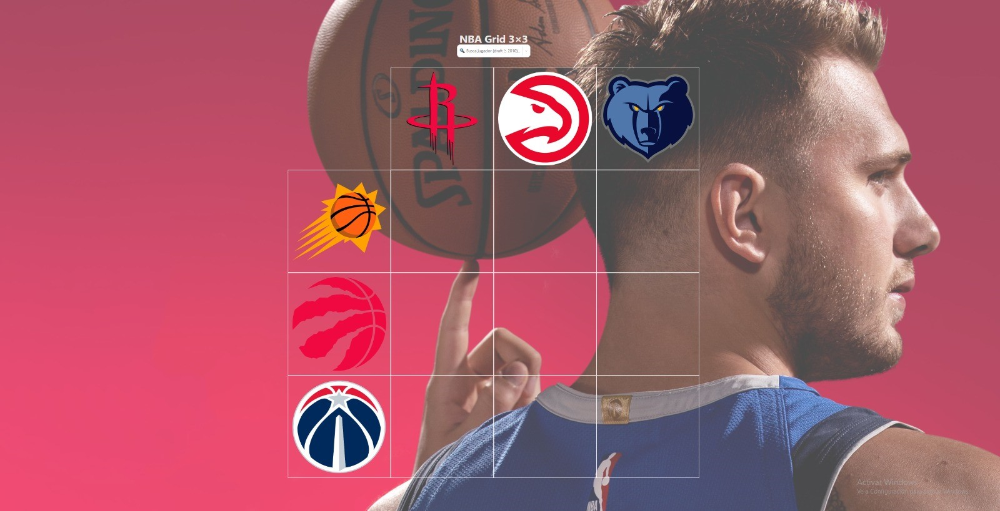

# NBA 3×3  
  

Un juego web para llenar un cuadrante 3×3 con jugadores que hayan pasado por ambos equipos seleccionados.  
Desarrollado con React, Tailwind CSS y un pequeño backend en Express que tira de la API de balldontlie.io.  

## 🚀 Tecnologías  
- React + TypeScript  
- Tailwind CSS  
- Express.js (API propia para evitar CORS)  
- balldontlie.io (datos NBA)  

## ⚙️ Cómo arrancar  
1. Clona el repo y ve a la carpeta:  
   ```bash
   git clone https://github.com/JaviRL7/NBA.git
   cd NBA
